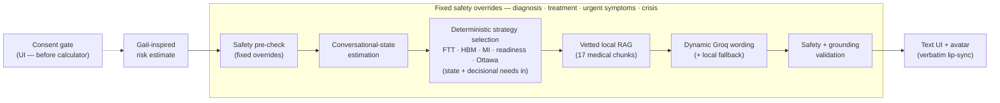

# VARE adaptive orchestration pipeline

Updated diagram reflecting the implemented chat + avatar flow. Groq never
chooses dialogue strategy or invents medical facts outside retrieved evidence.

## Flowchart (Mermaid)

## Stage summary

| Stage | What it does | Psychological / theory link |
|-------|----------------|-----------------------------|
| **Consent gate** | User must accept disclaimer before calculator/chat | Safety / scope (R7) |
| **Gail-inspired risk estimate** | Demo average vs elevated branch feeds chat context | Entry point only |
| **Safety pre-check** | Fixed replies for crisis, urgent symptoms, diagnosis/treatment asks | Runs **first**; can short-circuit pipeline |
| **Conversational-state estimation** | Understanding, emotion, barrier, self-efficacy, readiness, decisional-needs update | Input to strategy selection |
| **Deterministic strategy selection** | Picks dialogue + decision-support strategies from fixed rules | **FTT, HBM, MI, readiness, Ottawa** → `clarify_risk`, `explore_barrier`, `clarify_options`, `prepare_questions`, etc. |
| **Vetted local RAG** | Retrieves top medical chunks (no live web) | Facts only — not strategy |
| **Dynamic Groq wording** | Phrases the reply; falls back locally if Groq fails | LLM does **not** pick strategy |
| **Safety + grounding validation** | Blocks unsafe output; checks evidence use | Final check before UI |
| **Text UI + avatar** | Text always shown; LiveAvatar LITE lip-syncs validated text only | Delivery only |

## How strategy selection uses both layers

Inside the **Deterministic strategy selection** step (code runs in this order):

1. Update **conversational state** (emotion, understanding, barriers, readiness)
2. Update **decisional needs** (options, preferences, drafts, timing — Ottawa-inspired)
3. Pick **dialogue strategy** from FTT / HBM / MI / readiness (`worker/behavioral/policy.ts`)
4. Pick **decision-support strategy** from Ottawa constructs (`worker/decisionSupport/selectDecisionSupportStrategy.ts`)

The diagram shows one box because both are deterministic and Groq never chooses either — but both happen at this stage.

## Files

- SVG (submission-ready): [`pipeline-diagram.svg`](./pipeline-diagram.svg)
- Orchestration code: `worker/orchestration/orchestrateDialogueTurn.ts`
- Strategy policy: `worker/behavioral/policy.ts`, `worker/decisionSupport/selectDecisionSupportStrategy.ts`
